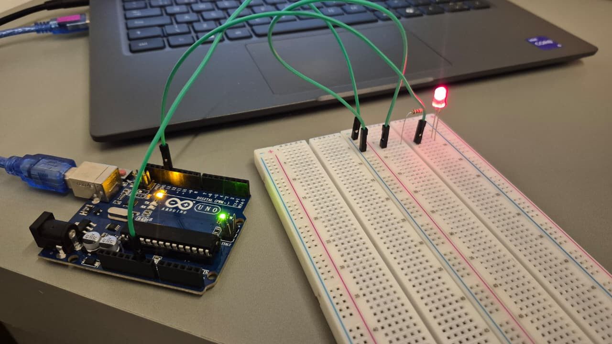

### Protótipo Arduino com LED

   
  <em>Montagem simples do circuito com LED piscando controlado pelo Arduino.</em>

---

### Demonstração em vídeo

  <video width="400" controls>
    <source src="./assets/VideoArduinoLed.mp4" type="video/mp4">
  </video> 
  <em>Execução do código Blink no Arduino, com o LED acendendo e apagando em intervalos regulares.</em>

